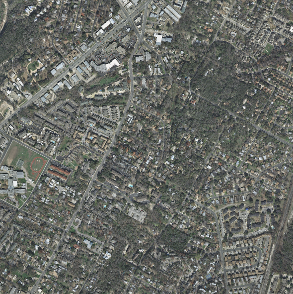
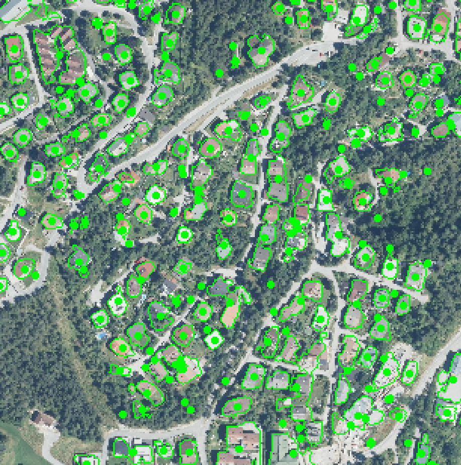
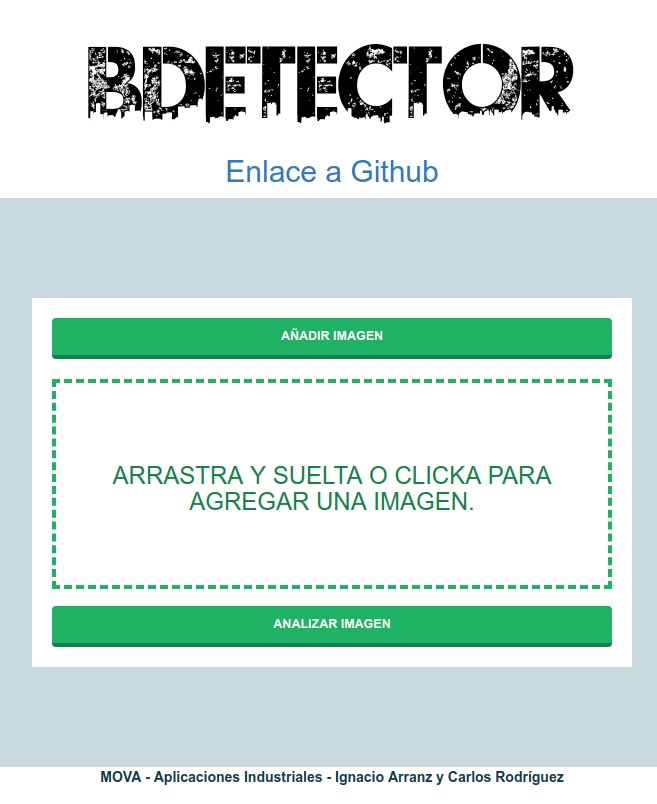
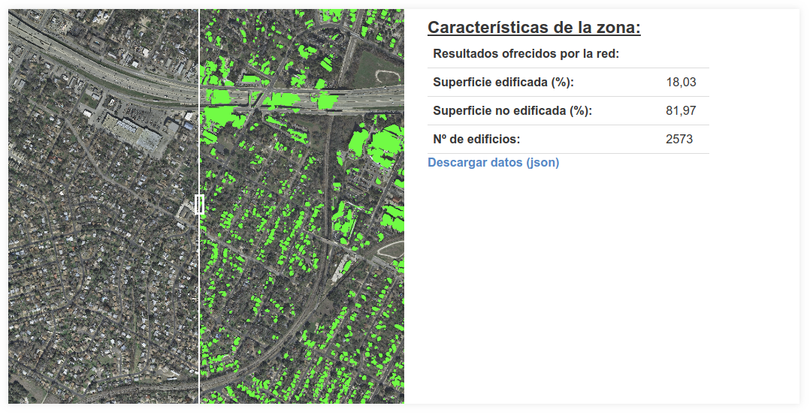

# MOVA - AIC - Segmentación de edificios

Este proyecto se desarrolla en el [Máster Oficial en Visión Artificial](https://mastervisionartificial.es) para la asignatura de Aplicaciones Industriales y Comerciales y tiene como objetivo la segmentación de tejados a partir de imágenes satélite proporcionadas por el _dataset_ [Inria](https://project.inria.fr/aerialimagelabeling/files/).

Las imágenes proporcionadas por el _dataset_ son de 5000x5000 píxeles y tienen el siguiente aspecto:



El objetivo es la localización y segmentación de los tejados de las viviendas para un posterior tratamiento de los datos.


## Entrega 1 - Requisitos y ecosistema

[Este documento](https://github.com/igarag/aiva-mova-satelite/blob/master/docs/DocumentoVision/README.md) contiene los siguientes puntos:

- Sección "La visión".
- Sección de "descripción amplia y poco profunda".
- Planificación detallada de tareas.
- Elementos como enlaces al proyecto y sus correspondientes *issues,*


---------------

## Entrega 2 - Diseño de la solución

En esta entrega se muestra el **resultado del algoritmo de visión para una imagen fija dada**, desde la etapa de carga de una imagen extraída del *dataset* hasta la extracción de las viviendas así como datos estadísticos para un posterior análisis.

Para **replicar la infraestructura** y poder ejecutar estas pruebas en un ordenador local hay que seguir los siguientes pasos.

### Uso

- **Descarga del repositorio.** Clonar el repositorio (por ejemplo) en el `home` del usuario.

  ```bash
  git clone https://github.com/igarag/aiva-mova-satelite.git ~/
  ```

- **Crear entorno virtual**. Se utiliza un entorno virtual que *encierra* el programa en un entorno que lo aísla del sistema original. Dado que el programa funciona bajo **Python** en su versión **3.6**, se especifica esta versión en la creación del entorno virtual. Se fuerza una **instalación limpia** (que no tenga dependencia de otros entornos virtuales) con el argumento `--no-site-packages`. El nombre elegido para el entorno se fija como último argumento.

    ```bash
    virtualenv -p python3 --no-site-packages mova-aiva-venv
    ```

    Una vez instalado el entorno virtual se **activa** con el siguiente comando:

    ```bash
    source mova-aiva-venv/bin/activate
    ```

    El entorno estará activado cuando aparezca el indicador con el nombre del entorno al principio del *command prompt*:

    ```bash
    (mova-aiva-venv)user@host:~$
    ```
    *Nota: Para desactivarlo teclear `deactivate`*.

- **Instalar dependencias**. Los **paquetes necesarios** para ejecutar el algoritmo son los que se listan a continuación.

    ```bash
    pip install tensorflow
    pip install keras
    pip install opencv-python
    pip install matplotlib
    pip install numpy
    ```
    *Nota: los siguientes comandos se ejecutan dentro de la consola con el entorno virtual activado*.

    Pueden instalarse  estas dependencias utilizando el archivo `requirements.txt` alojado en el directorio `docs` y ejecutando el siguiente comando:

    ```bash
    pip install -r requirements.txt
    ```


- **Modelo entrenado**. Para la ejecución del algoritmo es necesario el modelo ya entrenado de la red neuronal. Dado que el contenido es muy pesado para alojarse junto con el repositorio, se facilita el enlace para su descarga. [Descarga el modelo entrenado de la red en este enlace.](https://drive.google.com/open?id=1HqRxhxKq9jM3eR4UtV_w6GjQp4CP2TXy) Una vez descargado el modelo, incluirlo en el directorio `docs` de la raíz del proyecto.

- **Ejecutar algoritmo.** Para poner en marcha el programa hay que ejecutar el archivo `main.py ` de la carpeta `src` que se encuentra en la raíz del proyecto. Para ello entramos en el directorio y ejecutamos el programa.

  ```bash
  cd src/
  python main.py
  ```

Este programa coge del directorio `src` una imagen de *test* y da como **resultado** en el directorio `src/data`  un fichero `output.png` y un fichero `data.txt` en la raíz del proyecto donde se tiene la imagen resultante de la segmentación y los datos del número de casas, áreas y centros de las áreas respectivamente. En siguientes entregas se trabajará sobre estos datos para extraer conclusiones sobre las imágenes de entrada.

### Resultados

El resultado del algoritmo con la imagen que se adjunta en el mismo directorio donde se ejecuta el programa `main.py` arroja como resultado la siguiente imagen.


Puede verse como las **casas** de la imagen satélite quedan **totalmente segmentadas**. En la siguiente imagen puede verse el resultado con un punto de vista más próximo donde se aprecia el borde que contiene la casa así como el centro del área contenida. *Nota: algunos de los puntos marcados como centros coinciden con una segmentación muy pequeña que hace que el punto centro tenga mayor área que la casa que segmenta*.



Con esta imagen de test ofrecida y en este punto del proyecto, los resultados extraídos son el **número total de casas** que segmenta la red así como el **área** de cada una de ellas.


### Testing

Pueden ejecutarse los test disponibles hasta el momento con el fichero `test.py`. Para ejecutar los test hay que posicionarse en la raíz del proyecto:

```bash
aiva-mova-satelite/
├── docs
├── mockup
├── src
└── test
```

Una vez en este directorio ejecutar la sentencia:

```bash
python -m unittest discover -v -s test
```

Dejando unos segundos se ofrecerá el resultado de los test.


---------------

## Entrega 3

Este documento contiene los siguientes puntos:

- Introducción.
- Despliegue.
- Funcionamiento del sistema.
- Conclusiones.

#### Uso de la aplicación

Para usar la aplicación puede irse a [esta URL]() para **probarla** online o bien descargarse la imagen de *Docker* que contiene la aplicación. Para la descarga se introduce el siguiente comando por terminal:

```bash
docker pull nachoaz/mova-aiva-build-detector:final
```

Una vez se tiene la imagen descargada, **ejecutarla** con el siguiente comando:

```bash
docker run -it -p 8000:8000 --entrypoint /home/entrypoint.sh aiva-build-detector:no-apache-v3
```

Los **argumentos** que se activan al lanzar el contenedor con `run` son:

- `-it` para recuperar el control del contenedor cuando se lanza.
- `-p 8000:8000` que mapea el puerto 8000 del interior del contenedor con el puerto 8000 de la máquina donde se está ejecutando el contenedor.
- `--entrypoint`: Con esta orden estamos ejecutando el *script* por defecto cuando se arranca la imagen. Esto arranca tanto el *backend* de TensorFlow como el servidor Django.

Una vez se ha lanzado el contenedor y accediendo a la dirección [localhost:8000](localhost:8000) se tiene **acceso a la aplicación**. En la siguiente imagen puede verse la página de inicio de la aplicación.



Para **agregar una imagen** puede clickarse en "Añadir Imagen", arrastrar y soltar en el área destinada para ello o clickar en el área.  Pulsando en "Analizar Imagen" comienza el proceso de carga de la segmentación que puede demorarse **unos segundos**. Al final, el resultado muestra la imagen segmentada con un deslizador que permite mostrar una comparativa entre la imagen segmentada y la original. Además, a la derecha, se muestran estadísticas de los datos obtenidos de la segmentación. En la siguiente imagen se pueden ver los campos que se comentan.




### Documentación

En cada entrega se adjunta además un documento `pdf` con la explicación detallada de las decisiones tomadas para la creación del algoritmo así como su estructura utilizando ejemplos de uso y diagramas en lenguaje UML. *Nota: Este documento no se encuentra, por ahora, en el repositorio*.


-----
Desarrolladores:
- [Ignacio Arranz](https://github.com/igarag)
- [Carlos Rodríguez](https://github.com/crodriguezgarci)
