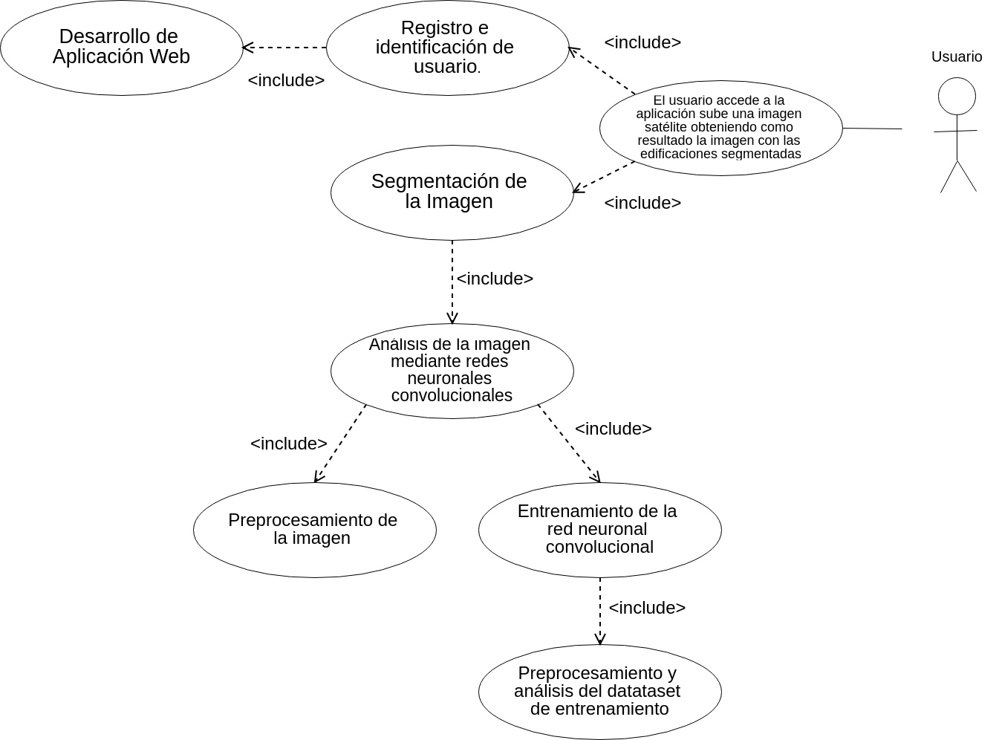

# Entrega 1 - Requisitos y ecosistema

Esta es la **primera entrega** de la asignatura de [Aplicaciones Industriales y Comerciales](https://www.urjc.es/estudios/master/834-vision-artificial) del [Máster Oficial en Visión Artificial](https://mastervisionartificial.es) donde se presentan los requisitos y el ecosistema de una aplicación para detección de tejados a partir de [imágenes satélite](https://project.inria.fr/aerialimagelabeling/files/).

## 1. Introducción.

Este documento tiene como **objetivo** analizar y definir los requisitos de alto nivel de un proyecto de segmentación tejados de viviendas. El objetivo es desarrollar un sistema de visión artificial que permita detectar y segmentar tejados de viviendas a través de imágenes satélite. Está destinado tanto a instituciones públicas como empresas privadas. La adquisición de imágenes satélite permite un punto de vista genérico sobre distintas zonas de una ciudad aportando información alternativa a la que se obtiene con imágenes en tierra.

### 1.1 Propósito.

El proyecto surge como respuesta al problema acuciante de la falta de información actualizada o directamente carencia total de esta sobre zonas edificadas y sobre las dimensiones individual de cada una de las construcciones. 

### 1.2 Alcance.

El sistema permitirá tener más conocimiento acerca de las distribuciones de las viviendas de las zona donde se tenga las imágenes satélite. En muchos países como EEUU no existen registros con este tipo de información o son opcionales para los propietarios y aunque en algunos países, como en España, existen registros oficiales con información sobre construcciones y edificios, esta información puede estar desactualizada.

### 1.3 Declaración del problema.

En la siguiente tabla se resume la descripción del problema y la solución que ofrece.

| Situación          | Descripción                                                  |
| ------------------ | ------------------------------------------------------------ |
| El problema        | Los medios actuales de segmentación de la vivienda pasan por demasiados procesos hasta tener unos resultados útiles para el conocimiento de características del entorno. |
| Afecta             | Instituciones públicas y empresas privadas.                  |
| Impacto            | Conocimiento e información actualizada de la zona de estudio. |
| La solución podría | Acelerar el proceso de extracción de información para su conocimiento. |

### 1.4 Declaración del posicionamiento del producto.

La siguiente tabla describe la necesidad del producto en el mercado en función de las necesidades que se tienen para obtener la misma información.

| Situación        | Descripción                                                                                                |
|------------------|------------------------------------------------------------------------------------------------------------|
| Para             | La empresa contratante                                                                                     |
| Quien            | Necesita de información acerca de las viviendas en  una región.                                            |
| Que              | Utiliza para poner en marcha obras civiles, registro  de propiedades, etc.                                 |
| A diferencia de  | El sistema actual (en proceso de implementación).                                                          |
| Este producto    | Permite recabar esos datos con la certeza de estar  actualizados en el momento de la captura de la imagen. |

### 1.5 Usuarios a los que está destinado.

Algunos ejemplos de instituciones interesadas en el proyecto:

- **Instituciones públicas:**
  - Conocer extensión real y actualizada del área construida en una zona.
  - Localizaciones de nuevas construcciones no registradas.
  - Estudio de terreno para planificación de obras de red de carreteras.
- **Empresas Privadas:**
  - Aseguradoras de viviendas que buscan tener información actualizada sobre los vienes asegurados.
  - Medidas de los tejados para la colocación de paneles solares.

### 1.6 Ventajas del proyecto

Las principales **ventajas** que ofrece este proyecto es que permite mantener esta **información actualizada** con **bajo coste** ya que el sistema funciona con imágenes vía satélite que pueden ser obtenidas mediante proveedores como [Openstreetmap](https://www.openstreetmap.org) (*open source*) o [GoogleMaps](https://www.google.com/maps). Esto permite obtener muestras **evitando el desplazamientos** a la zona de interés donde la adquisición de datos previos por parte de un técnico generaría un aumento de los costes. De esta manera se consigue **sistema muy ágil**, **no intrusivo** y de **coste contenido** que permite extraer este tipo de información.

## 2. Descripción amplia y poco profunda.

El **principal caso de uso** de la aplicación es: un usuario se identifica mediante credenciales en la plataforma generada en el proyecto. Una vez autenticado y mediante el interfaz de usuario sube una o varias imágenes satélite y obtiene como resultado la imagen segmentada con las edificaciones presentes en la imagen original.

Como principal requisito no funcional destacar que el sistema debe de funcionar dentro de una aplicación que permita el análisis vía web de las imágenes.

El principal y único caso de uso del sistema es el siguiente:

- El usuario se autentica en la aplicación mediante credenciales personales.
- Una vez identificado el usuario sube una o más imágenes satélite a la plataforma.
-  El servidor recibe las imágenes y procede a su segmentación. Para ello en primer lugar preprocesa las imágenes para adaptarlas a las características de entrada de la red neuronal.
- A continuación introduce la imagen preprocesada en la red neuronal previamente entrenada con los datos de entrenamiento.
- Una vez analizada por la red neuronal y obtenida la imagen segmentada se le envía al usuario para su descarga.

### 2.1. Diagrama de flujo

En la siguiente figura puede verse un **diagrama de flujo** del sistema completo donde, después del acceso a la aplicación se alimenta el sistema con una **imagen de entrada** a través de un formulario web donde se **adjunta el archivo**, este se procesa y ofrece al usuario la **imagen resultante** ya segmentada.

## 3. Planificación de las tareas.

El proyecto prevé los siguientes plazos:

| Descripción                                                                                  | Planificación | nº issue |
|----------------------------------------------------------------------------------------------|---------------|----------|
| Utilizar U-Net como red base para atacar el problema. Entrenamiento y estudio de resultados. | 1 semana      | [#3](https://github.com/igarag/aiva-mova-satelite/issues/3)       |
| Data Augmentation. Para robustecer la red neuronal.                                          | 2 días        | [#2](https://github.com/igarag/aiva-mova-satelite/issues/2)       |
| Creación de la estructura básica de la aplicación web,                                       | 3 días        | [#5](https://github.com/igarag/aiva-mova-satelite/issues/5)       |
| Registro de usuarios para el acceso a la plataforma,                                         | 1 día         | [#6](https://github.com/igarag/aiva-mova-satelite/issues/6)       |
| Crear sitio web para enviar formulario con la imagen a segmentar.                            | 2 días        | [#9](https://github.com/igarag/aiva-mova-satelite/issues/9)       |
| Crear lógica en el servidor para recibir formularios con imágenes,                           | 3 días        | [#8](https://github.com/igarag/aiva-mova-satelite/issues/8)       |
| Integración entre la aplicación y red neuronal                                               | 1 semana      | [#10](https://github.com/igarag/aiva-mova-satelite/issues/10)     |
| Test de la aplicación y evaluación de resultados                                             | 4 días        | [#12](https://github.com/igarag/aiva-mova-satelite/issues/12)      |
| Puesta en producción                                                                         | 2 días        | [#11](https://github.com/igarag/aiva-mova-satelite/issues/11)      |

## 4. Enlace al proyecto en GitHub

El documento contiene un `README.md` con la descripción del proyecto. Este repositorio será compartido entre Ignacio Arranz Águeda y Carlos Rodriguez García.

[Enlace a la raíz del proyecto](https://github.com/igarag/aiva-mova-satelite)
