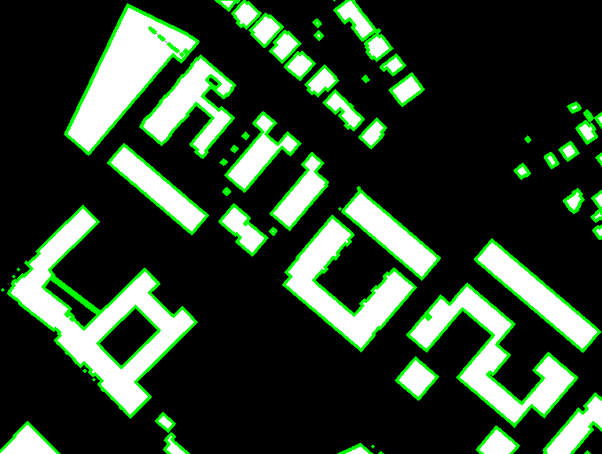

# Mockups

Esta sección está dedicada a la creación de *mockups* para suplir partes del proyecto aún no desarrolladas o implementadas.

Esta pequeña **demostración** coge una imagen de *groundtruth* obtenida del [dataset](https://project.inria.fr/aerialimagelabeling/files/) y busca los contornos para remarcar cada uno de ellos.

Como siguiente trabajo está el proyectar en la imagen las coordenadas de cada contorno con el fin de que sean almacenados en una base de datos para su posterior tratamiento.

## Uso

**Clonar** el repositorio:

```bash
git clone https://github.com/igarag/aiva-mova-satelite.git mockup
```

**Navegar** hasta el directorio alojado en `mockup`:

```bash
cd mockup
```

**Ejecutar** el programa:

```bash
python findCountours_test.py
```

**Elegir** entre las opciones **1** o **2** donde se conmuta entre dos imágenes de ejemplo para mostrar dos resultados del programa. El resultado del programa devuelve algo como la siguiente imagen:



## Changelog

- _2019-03-04 - Detección de contornos de la imagen procesada._
