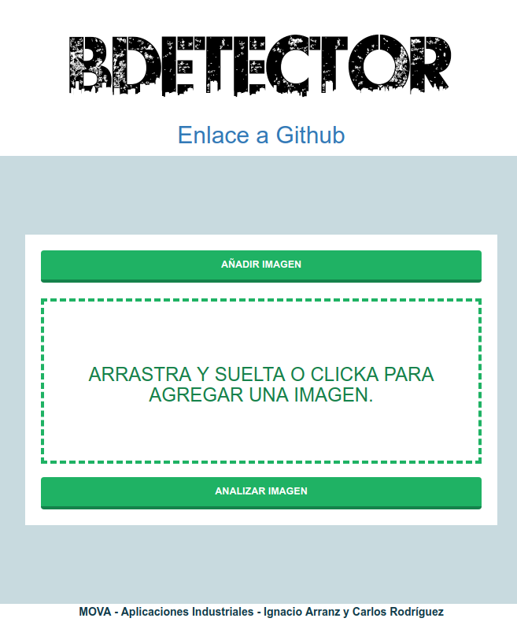

# Uso de la aplicación

Para usar la aplicación puede irse a [esta URL]() para probarla online o bien descargarse la imagen de *Docker* que contiene la aplicación. Para la descarga se introduce el siguiente comando por terminal:

```bash
docker pull ...
```

Una vez se tiene la imagen descargada, ejecutarla con el siguiente comando:

```bash
docker run -it -p 8000:8000 --entrypoint /home/entrypoint.sh aiva-build-detector:no-apache-v3
```

Los argumentos que se activan al lanzar el contenedor con `run` son:

- `-it` para recuperar el control del contenedor cuando se lanza.
- `-p 8000:8000` que mapea el puerto 8000 del interior del contenedor con el puerto 8000 de la máquina donde se está ejecutando el contenedor.
- `--entrypoint`: Con esta orden estamos ejecutando el *script* por defecto cuando se arranca la imagen. Esto arranca tanto el *backend* de TensorFlow como el servidor Django.

Una vez se ha lanzado el contenedor y accediendo a la dirección [localhost:8000](localhost:8000) se tiene acceso a la aplicación. En la siguiente imagen puede verse la página de inicio de la aplicación.



Para agregar una imagen puede clickarse en "Añadir Imagen", arrastrar y soltar en el área destinada para ello o clickar en el área.  Pulsando en "Analizar Imagen" comienza el proceso de carga de la segmentación que puede demorarse unos segundos. Al final, el resultado muestra la imagen segmentada con un deslizador que permite mostrar una comparativa entre la imagen segmentada y la original. Además, a la derecha, se muestran estadísticas de los datos obtenidos de la segmentación.